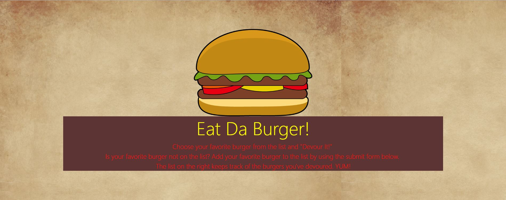
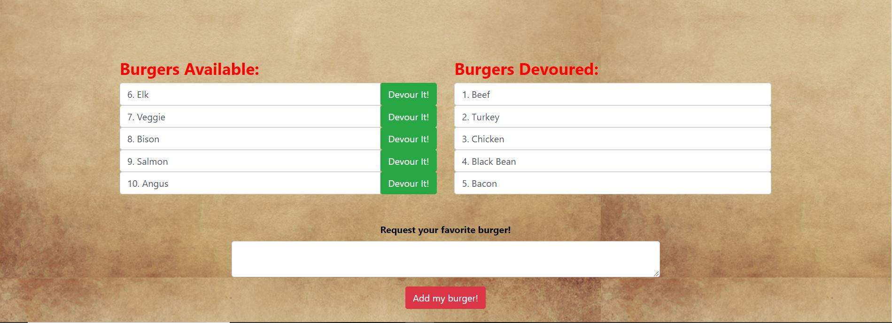

# Eat-Da-Burger App - Node Express Handlebars

-----------


### Description
* Eat-Da-Burger! is a restaurant app that lets users input the names of burgers they'd like to eat.

* Whenever a user submits a burger's name, this app will display the burger on the left side of the page -- waiting to be devoured.

* Each burger in the waiting area also has a `Devour it!` button. When the user clicks it, the burger will move to the right side of the page.

* This app will also store every burger in a MySql database, whether devoured or not.
-------------
### Instructions:

Click on the below heroku link:
* [https://mysterious-refuge-79948.herokuapp.com/]https://mysterious-refuge-79948.herokuapp.com/

### OR

Step 1 - Clone my repo using the command line below
```
git clone https://github.com/vjcardoza2011/burger.git
```
Step 2 - Change directory to the cloned repo folder
```
cd burger
```
Step 3 - Install all required NPM packages
```
npm install
```
Step 4 - Start the application server using the command line below
```
node server.js
```





